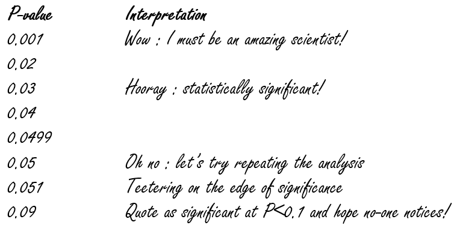

```{r setup, include=FALSE}
library(learnr)
library(mosaic)
knitr::opts_chunk$set(echo = FALSE)
```


## p-values, Effect sizes

### 95% Confidence intervals 

We have already briefly touched on 95% confidence intervals, sometimes described as 95% CI, when we discussed measuring variability in your data. [See here for a reminder](https://naturalandenvironmentalscience.shinyapps.io/variation/#section-confidence-intervals). One of the disadvantages of 95% CI is that they are often misunderstood, even by scientists with many years of experience. Try out this little quiz; **Hint**: I tried it once with my colleagues, and most of them gave the wrong answer!

```{r interpret95ci}
question("You take 6 randomly placed vegetation quadrats in a hay meadow, 1 m-square, and count the number of flowering plant species in each quadrat. The average number of species per m-squared is 13.0, with a 95% CI of +/- 2.5 . Which of the following statements is true?",
         answer("Additional vegetation quadrats should have been taken"),
         answer("There is a 95% probability of the mean number of species being between 10.5 and 15.5"),
         answer("If an additional 6 quadrats are collected there is a 95% probability that the mean number of species will be between 10.5 and 15.5"),
         answer("If one additional quadrat is surveyed there is a 95% probability that the mean number of species per m-squared is between 10.5 and 15.5"),
         answer("If you repeated the survey 20 times, there is a 95% probability that the mean number of species per m-squared would be between 10.5 and 15.5 on 19 of the surveys", correct=TRUE),
         answer("If you take 5 additional quadrats, the mean number of species per metre should be 13.0 with a probability of 0.95")
)
```

If you are like most people you may have ticked the wrong answer, and the correct one is a bit of a surprise. Most people incorrectly interpret 95% as **Bayesian credible intervals**, in that they make the mistake of assuming that there is a 95% probability that the mean value lies between the upper and lower bands. However they are actually **95% confidence intervals** which relates to what the average is in a set of **samples**, **populations** and **effect sizes**. Before going any further, it will be useful to define some of these terms.

## Populations and samples
These two terms are used by statistians in any discipline of science, to refer to particular statistical concepts. However, as ecologists we're used to thinking about populations as being a 'population of animals' etc., and so it is easy to get confused by the statistical geekdom. Let's go back to our hay meadow, where we want to work out the mean number of species per $m^2$. Here's a representation of your meadow:


As you might expect, some parts of your meadow have lots of species of flowering plants present, others parts relatively few and dominated by grasses. So what is the mean number of flowering plants per $m^2$ in your meadow? There are two approaches:

* get down on your hands and knees, and spend a whole week surveying every inch of the meadow, and at the end of the week divide the number of flowering plants by the area of the meadow (assuming you are still capable of standing up). This is the **population mean**
* randomly place 6 vegetation quadrats, each $1m^2$ in your meadow, and calculate the average number of flowering plants from your quadrats. This is the **sample mean**.

In many, if not most situations, it is actually impossible to determine the population mean reliably, hence we use sample means. The problem with sample means is that because of their inherent randomness, such as our 6 randomly placed quadrats, you will get a slightly different result each time. The more quadrats you take, the smaller the 95% CI around your sample mean, but there will still be variability.

## Effect sizes
### What are effect sizes and why do they matter?
When you present the results of a study to policy-makers, you could say something like:

* "Our new low-intensity management regime on haymeadows was amazingly successful and increased the number of flowering plants and was highly significant (F=6.87, p<0.001)"

or you could say:

* "Our low intensity management regime increases overall farmer costs by £6/ha and resulted in an increase in the numbers of flowering plants from 13.0$m^2$ to 25.8$m^2$

Which is better? The second not only is much more neutral and professional in its wording, but also explains clearly the costs and benefits of the new low intensity management regime. A policy maker will care much more about these issues than an F-ratio and p-value from a statistical test.

### Problems with mis-use of NHST and p-values
A major issue with p-values is that on there own they do not give any indication of the magnitude of an experimental effect (or even the direction positive or negative). There is also an issue if the 'traditional' 0.05 cut-off is treated to strictly that it can lead to subjective biases in reporting...



Let me stress that there is nothing inherently wrong with p-values; indeed they are lurking in most of my papers somewhere. It is their mis-use that can cause problems. Given a very large sample size it is possible to obtain highly significant results that are of little real-world interest. For example, suppose you survey a conventionally managed and organically haymeadows with a huge 50 vegetation quadrats each. You could end up with p=0.0000004534 which is massively significant, but if the mean number of species of plants $m^2$ only went up from 13.0 to 13.8 it would not be of practical value. Also remember that 0.05 is arbritary, so even if your results are "non-significant" they should still be reported, with the p-value given in full.

Therefore, when reporting p-values, it is essential to record some measure of variation (sd, se or 95% CI), the number of replicates, and also the effect size. This area is quite contentious. I suggest you look at [this paper in Conservation Biology](https://conbio-onlinelibrary-wiley-com.libproxy.ncl.ac.uk/doi/full/10.1111/j.1523-1739.2006.00525.x) for criticism of null hypothesis significance tests and p-values, and also [this one from Ecology](https://esajournals.onlinelibrary.wiley.com/doi/full/10.1890/13-0590.1?casa_token=GLWn_k3GHQEAAAAA%3AW2ZcXhWsih4A3Y9ZmOpP40cpyfJiq2gU6tOb6NaVNb-JRTS9xw7yv3hO7Indl98gz3X3QTySlupKnw) defending their use.

You might also find [this video](https://www.youtube.com/watch?feature=player_embedded&v=ez4DgdurRPg) of dancing p-values from Geoff Cummings entertaining and informative. There is also [this interactive](https://rpsychologist.com/d3/ci/) on confidence intervals and p-values helpful to your understanding.

Write the R code required to add two plus two:

```{r two-plus-two, exercise=TRUE}

```

### Exercise with Code

*Here's an exercise with some prepopulated code as well as `exercise.lines = 5` to provide a bit more initial room to work.*

Now write a function that adds any two numbers and then call it:

```{r add-function, exercise=TRUE, exercise.lines = 5}
add <- function() {
  
}
```

## Topic 2

### Exercise with Hint

*Here's an exercise where the chunk is pre-evaulated via the `exercise.eval` option (so the user can see the default output we'd like them to customize). We also add a "hint" to the correct solution via the chunk immediate below labeled `print-limit-hint`.*

Modify the following code to limit the number of rows printed to 5:

```{r print-limit, exercise=TRUE, exercise.eval=TRUE}
mtcars
```

```{r print-limit-hint}
head(mtcars)
```

### Quiz

*You can include any number of single or multiple choice questions as a quiz. Use the `question` function to define a question and the `quiz` function for grouping multiple questions together.*

Some questions to verify that you understand the purposes of various base and recommended R packages:


